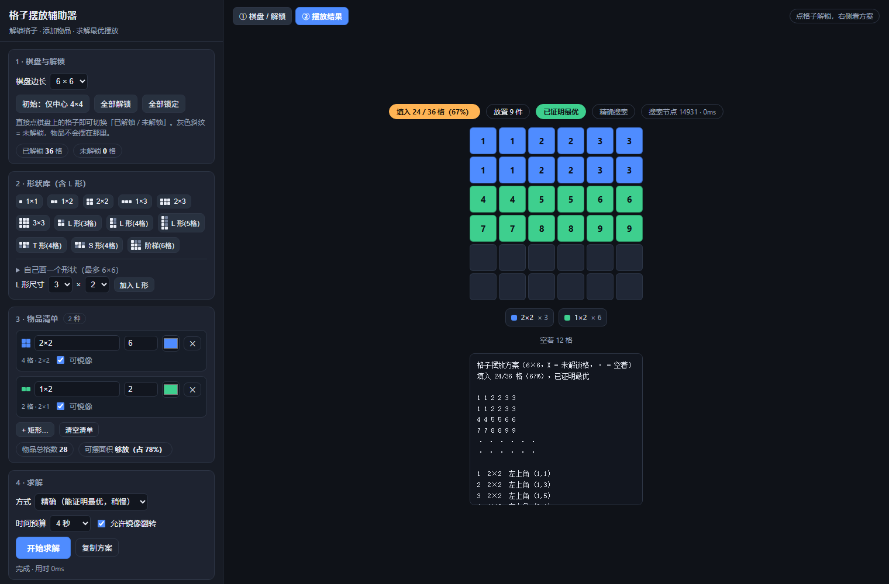

# 格子摆放辅助器

一个纯前端的「格子摆放 / 装箱」小工具：**初始只有中间 4×4 可用，外面一圈需要手动解锁（解锁完就是 6×6）**，
把各种形状（含 **L 形**）的自定义物品按数量丢进去，工具会算出**最优摆放方案**（尽量把格子填满）。

- 纯静态网页，双击 `index.html` 就能用，**不需要安装任何东西、不联网**
- 支持任意自定义形状（自己点格子画）、任意数量、任意棋盘边长（5×5 ~ 9×9）
- 求解器有两条路：**精确搜索（能证明“这就是最优”）** 与 **快速启发式**（大盘秒出方案）



---

## 1. 怎么打开

**方式一（最简单）：** 双击 `index.html`，用浏览器打开即可。

**方式二（用 http 打开，可选）：** 需要本机有 Node.js，在本文件夹里执行

```bash
node serve.mjs
```

然后浏览器访问 `http://127.0.0.1:8787` 。

> 用 Chrome / Edge / Firefox 等现代浏览器都可以。

**想分享给别的网友？** 见 [`如何分享给网友.md`](如何分享给网友.md)：可以只发一个
`格子摆放辅助器-单文件版.html`（双击即用），也可以拖到 Netlify Drop / 挂到 GitHub Pages 得到网址。
单文件版用 `node build-single.mjs` 生成。

---

## 2. 界面怎么用

### ① 棋盘与解锁（右侧第一个标签页）

- 棋盘默认 **6×6**，其中**中间 4×4 已解锁，外面一圈（20 格）是锁着的**（灰色斜纹）。
- **直接点格子**就能切换「解锁 / 未解锁」。物品不会摆到未解锁的格子上。
- 按钮：
  - `初始：仅中心 4×4` —— 回到“只有中间可用”的状态
  - `全部解锁` —— 36 格全开
  - `全部锁定` —— 全关（用来清空重画）
- 想换棋盘大小，用左上角「棋盘边长」下拉框（5×5 ~ 9×9）。换尺寸后自动回到“只有中间 (边长-2)² 可用”的状态。

### ② 形状库（含 L 形）

- 点任意预置形状即可加入物品清单：`1×1`、`1×2`、`2×2`、`1×3`、`2×3`、`3×3`、**L 形（3 格 / 4 格 / 5 格）**、T 形、S 形、阶梯形。
- **L 形**可以直接指定两条臂长：选好「L 形尺寸 a × b」后点「加入 L 形」。
- **自己画形状**：展开「自己画一个形状」，在 6×6 画布上点格子拼出任意形状 → 起个名字 → 「加入物品清单」。
  - 形状会自动**贴边归一化**，之后可以旋转（默认还会镜像翻转）来摆放。

### ③ 物品清单

每种物品一行：

| 控件 | 作用 |
| --- | --- |
| 名字 | 显示在结果图上的编号说明里 |
| 数量 | 这种物品要摆几个 |
| 颜色 | 结果图里这种物品的颜色 |
| 可镜像 | 关掉就只允许**旋转**，不允许翻转（L 形、S 形这类会因此少一半朝向） |
| ✕ | 删除这种物品 |

### ④ 求解

- **方式**
  - `精确（能证明最优，稍慢）`：分支限界完全搜索。跑完就说明“不可能更满了”，结果带「已证明最优」标记。
  - `快速（启发式，几乎秒出）`：束搜索，适合物品特别多/棋盘特别大的时候。
- **时间预算**：精确搜索最多花多久。到点没跑完会自动转用启发式，并标注“当前找到的最好方案”。
- **允许镜像翻转**：全局开关，对所有物品生效。
- 点「开始求解」（或按 `Ctrl/Cmd + Enter`），右侧自动切到「② 摆放结果」。
- 「复制方案」把结果复制成纯文本（含带编号的摆放图 + 每件物品的左上角坐标）。

### ⑤ 摆放结果

- 彩色格子图：每个编号对应一件物品，图下面列出每件的位置。
- 顶部徽章会告诉你：填入多少格、放了几件、**是否已证明最优**、用的哪种算法、搜索了多少节点、花了多少毫秒。
- 底部「放不下：…」列出实在塞不进去的物品和数量；「空着 N 格」告出还剩多少空格。
- 最后有一段纯文本方案，方便直接复制粘贴。

### ⑥ 存档

- 配置会自动存在浏览器本地（localStorage），下次打开还在。
- 「导出配置」把配置 JSON 复制到剪贴板；「导入配置」粘贴回来即可恢复。
- 「恢复默认」回到出厂状态。

---

## 3. 「最优」是什么意思

目标按优先级：

1. **填入的格子数最多**（越满越好）；
2. 同样满的前提下，**用的物品件数最少**。

「越满越好」是相对**已解锁的格子**而言的：锁着的格子既不参与统计也不能摆放。

不同的“方式”给出的保证不一样：

| 方式 | 保证 | 结果标记 |
| --- | --- | --- |
| 精确 | 搜索跑完 = **全局最优**（不会漏掉更满的方案） | 已证明最优 |
| 精确（超时） | 只保证是**目前找到的最好方案**，可能不是最优 | 当前找到的最好方案 |
| 快速 | 启发式，通常很好但不保证最优；若已把可用格全填满，则必然最优 | 当前找到的最好方案 / 最优（全填满） |

> 小贴士：如果结果标着「当前找到的最好方案」，可以把「时间预算」调大、或把方式换成「精确」再试一次；
> 棋盘或物品特别大时（例如 8×8 以上、物品几十件），精确搜索基本不可能跑完，用「快速」更实际。

---

## 4. 文件夹里都有什么

```
格子摆放辅助器/
├── index.html          入口页面，双击即可运行
├── css/styles.css      样式
├── js/
│   ├── pieces.js       形状工具：归一化、旋转/镜像、预置形状（含 L 形）
│   ├── solver.js       求解器：精确分支限界 + 束搜索启发式
│   ├── app.js          界面逻辑（棋盘、形状库、清单、求解、渲染结果、存档）
│   └── selftest.js     界面自检脚本（地址栏加 #selftest 时运行）
├── test/
│   ├── static.test.mjs 静态检查（HTML 的 id / 资源引用与 JS 是否对得上）
│   ├── solver.test.mjs 求解器测试（含与独立暴力算法对照）
│   ├── ui.test.mjs     界面逻辑测试（Node 内置 DOM 垫片里跑真实 app.js）
│   └── single.test.mjs 单文件版测试（内联后脚本是否完整、自检是否全过）
├── build-single.mjs    生成单文件版（把 css/js 内联成一个 html）
├── single/index.html   单文件版（同一份内容，便于打包）
├── 如何分享给网友.md    分享/部署办法（单文件、Netlify Drop、GitHub Pages…）
├── preview/            界面预览图
├── serve.mjs           可选的本地静态服务器
├── package.json        仅用于跑测试/起服务的脚本
└── README.md           本说明
```

---

## 5. 跑测试（可选，需要 Node.js 18+）

```bash
cd 格子摆放辅助器
npm test                 # 等于下面三条
node test/static.test.mjs
node test/solver.test.mjs
node test/ui.test.mjs
```

- `static.test.mjs`：检查 `index.html` 里定义的 id、引用的资源文件，是否和 JS 里用到的一致。
- `solver.test.mjs`：**29 项**断言。包含“4×4 用 2×2+L 形能否正好铺满”“面积不够时是否把能放的都放下”
  “**结果是否与独立暴力搜索的最优值一致**（4 组实例）”“大盘耗时与利用率”等。
- `ui.test.mjs`：**29 项**断言。在 Node 里用 mini-DOM 加载真实的 `app.js`，模拟点击解锁、
  加入 L 形、画自定义形状、改数量、求解、渲染结果、错误提示等交互。

想在浏览器里跑同一套界面自检：打开 `index.html#selftest`，页面底部会出现自检报告。

---

## 6. 实现要点（想改代码的话看这里）

- **形状表示**：一个形状是格子坐标数组 `[[r,c], ...]`，永远归一化到左上角贴边。
  旋转 90° 用 `(r,c) -> (c,-r)` 再归一化；镜像用 `(r,c) -> (r,-c)`；去重后得到全部朝向。
- **棋盘状态**：用一个 BigInt 位图（36 格以内），`available` 是已解锁格，
  `used` 是已占用/已放弃的格。所有“能不能放”的判断都是位运算。
- **完全性依据**（为什么精确搜索不会漏解）：
  每个状态只处理「行优先扫描到的、还有可能被盖住的第一个空格」。该格要么
  ① 被某个物品盖住，且该格必须正好是该物品摆放时的**左上角锚点**；要么 ② 永久留空。
  任何合法方案都能被这串操作唯一还原，所以枚举是完备的。
- **剪枝**：`已填格数 + min(剩余物品总面积, 剩余空格数)` 作上界，达不到当前最好解就回溯；
  任何物品都盖不住的“死格”直接跳过不算分支；同一行内等价的空洞图案只试最左的一种。
- **加速**：搜索前先用两种贪心策略各求一个下界，剪枝立刻生效；若贪心就已铺满，
  直接判定最优并返回（这也是为什么常见场景是毫秒级）。
- **锚点预计算**：每种物品的每个朝向，预先枚举棋盘上所有合法的左上角位置及其位掩码，
  搜索时只需按当前空格取候选，避免重复计算。

---

## 7. 常见问题

**问：为什么 6×6 全部解锁、物品明明面积够，却没能填满？**
答：能否填满取决于形状的搭配（例如 3 个 2×2 永远塞不进 3×3：面积够但几何上放不下）。
工具会给出它证明/找到的最好结果，并在结果里列出放不下的物品。

**问：锁着的格子会挡住物品吗？**
答：会。物品必须完整落在已解锁格子上，不能跨过锁定格——这符合“格子还没解锁就用不了”的直觉。

**问：只允许旋转不要镜像怎么设？**
答：在物品清单里取消那件物品的「可镜像」；或者取消求解区的「允许镜像翻转」一次性全关掉。

**问：支持多大的棋盘/多少物品？**
答：棋盘 5×5 ~ 9×9。物品数量不限制（界面里每件最多 999 个）。
物品特别多时建议用「快速」方式，精确方式在合理时间内证明不了最优会自动降级。
